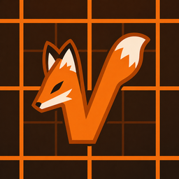

<div align="center">



# Foxy

Loads Voxy on NeoForge.

</div>

Voxy is a Fabric LoD rendering mod. Foxy makes it run on NeoForge without modifying
Voxy itself: it reads the unmodified Voxy jar at runtime and bridges the Fabric APIs
it uses over to NeoForge equivalents.

## How it works

- Reads `fabric.mod.json` from the Voxy jar and generates a synthetic `neoforge.mods.toml`
  (name, description, authors, icon, mixin configs, version) so FML loads it.
- Extracts Voxy's bundled `META-INF/jars` (RocksDB, LWJGL zstd/lmdb, lz4, xz, jedis) as
  game libraries.
- Applies Voxy's `voxy.accesswidener` live through ModLauncher/NeoForge transformation hooks.
- Ships minimal `net.fabricmc.*` stubs so Voxy's bytecode links; `FabricLoader` delegates
  to `ModList` / `FMLEnvironment`.
- Reimplements the `/voxy` command against NeoForge's command system.
- Adds a Chunky auto-ingest mixin on the 26.1.2 target. The 1.21.1 target omits that
  optional integration because the compatible Voxy backport is the priority.

Nothing about Voxy is hardcoded. Metadata, mixins, access wideners, and bundled jars are
all read from whatever Voxy jar is present, so Voxy updates do not require Foxy changes.

## Supported targets

- Minecraft 26.1.2 / NeoForge / Sodium / Voxy 0.2.16-beta
- Minecraft 1.21.1 / NeoForge 21.1.233 / Sodium 0.6.13 / a Mojmap Voxy 0.2.10-alpha
  backport jar

Voxy is All Rights Reserved and is not redistributed by this fork. For the 1.21.1 target,
build the compatible Voxy backport separately, then provide it to Foxy as a local Maven
artifact at `libs-maven/local/voxy/voxy/0.2.10-alpha/voxy-0.2.10-alpha.jar`.

## Building

```
./gradlew :26.1.2:build
./gradlew :1.21.1:build
```

## License

MIT. This does not relicense Voxy; Voxy remains All Rights Reserved and is not redistributed.
